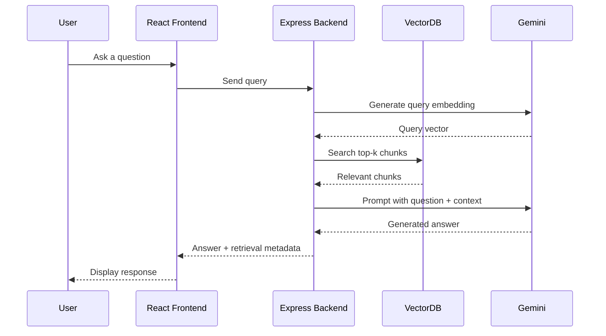

# VectorForge

VectorForge is a Node.js/Express backend with a Vite React frontend, using Gemini via Google GenAI for chat, embeddings, and RAG, and exposing vector search, benchmark, AI, auth, and PDF upload APIs.

The project demonstrates how an uploaded PDF can move through a complete semantic search pipeline:

1. Extract text from a PDF.
2. Split the text into meaningful chunks.
3. Generate vector embeddings with Gemini.
4. Store vectors in a custom in-memory VectorDB.
5. Compare search algorithms such as Brute Force, KD Tree, and HNSW.
6. Retrieve relevant chunks for a user query.
7. Use Gemini to generate a grounded RAG response.


## Project Overview

VectorForge is designed as an interview-friendly and learning-focused implementation of a vector search system. Instead of relying only on a managed vector database, the project exposes the core mechanics behind vector retrieval:

* How documents are converted into chunks.
* How chunks become embeddings.
* How vectors are indexed.
* How different search algorithms affect latency and recall.
* How retrieval connects to a RAG answer generation flow.

The system includes a Node.js/Express backend, Vite React frontend, Gemini-based embeddings and generation through `@google/genai`, and a custom VectorDB layer that supports multiple search strategies.

## Architecture

flowchart LR
    User["User"] --> Frontend["React / Vite Frontend"]
    Frontend --> API["Node.js / Express Backend"]

    API --> Upload["PDF Upload / Ingestion"]
    Upload --> Extract["PDF Text Extraction"]
    Extract --> Chunk["Text Chunking"]
    Chunk --> Embed["Gemini Embeddings"]
    Embed --> VectorDB["Custom In-Memory VectorDB"]

    VectorDB --> BF["Brute Force Search"]
    VectorDB --> KD["KD Tree Search"]
    VectorDB --> HNSW["HNSW Search"]

    VectorDB <--> Persistence["Vector Persistence Service"]
    Persistence <--> MongoDB["MongoDB / Mongoose"]

    Frontend --> Query["User Query"]
    Query --> QueryEmbed["Query Embedding"]
    QueryEmbed --> GeminiEmbed["Gemini Embedding API"]
    GeminiEmbed --> VectorDB

    VectorDB --> Context["Top-K Retrieved Chunks"]
    Context --> RAG["RAG Context"]
    RAG --> Gemini["Gemini Generation"]
    Gemini --> Frontend

    VectorDB --> Bench["Benchmarking"]
    Bench --> Metrics["Latency / Recall Results"]
    Metrics --> Frontend

    API --> Auth["Auth / OAuth / JWT"]
    Auth --> MongoDB

    API --> Swagger["Swagger API Documentation"]

    
## End-to-End Workflow

### 1. PDF Ingestion

The user uploads a PDF from the frontend. The backend receives the file and extracts readable text from the document.

Confirmed behavior:

* PDF ingestion is part of the implemented system.
* Text is extracted from uploaded PDFs.
* Extracted text is prepared for downstream chunking and embedding.

Confirmed implementation details:

* PDF parser package: `pdf-parse`
* Upload middleware: `multer`
* Maximum file size: `TODO: confirm from upload middleware config`
* Supported file types beyond `.pdf`: `TODO: confirm from upload validation`

### 2. Chunking

After extraction, the document text is split into fixed-size overlapping chunks. Chunking makes the content suitable for embedding and retrieval.

Confirmed implementation details:

- Chunk size: `500 characters`
- Chunk overlap: `100 characters`
- Chunking method: `Fixed-size character-based chunking with overlap`
- Chunk step: `400 characters`

### 3. Embedding Generation

Each chunk is converted into a numerical vector using Gemini embeddings.

Configuration required:

```env
GEMINI_API_KEY=your_gemini_api_key_here
```

```env
GEMINI_EMBEDDING_MODEL=gemini-embedding-001
```

Important model note: one response object may include the metadata label `text-embedding-004`, but the actual AI service code uses `gemini-embedding-001` through Google GenAI.

### 4. Vector Storage

Generated vectors are handled by the custom VectorDB layer and the project has MongoDB persistence implemented through Mongoose.

Current confirmed state:

* MongoDB/Mongoose persistence is implemented.
* Runtime vector indexes may still be loaded into memory for search and benchmark execution.
* The benchmark UI notes that benchmark vectors are cleared and reloaded before the benchmark runs.

Not currently claimed:

* Cloud vector database storage.
* Production-grade distributed indexing.

### 5. Search and Retrieval

When a user asks a question, the backend embeds the query and retrieves the most relevant chunks from the in-memory VectorDB.

The project includes multiple vector search approaches:

* Brute Force
* KD Tree
* HNSW

The retrieved chunks are passed into the RAG flow as context.

### 6. RAG Answer Generation

Gemini receives the user question plus retrieved document context and generates an answer grounded in the uploaded PDF content.

Expected RAG flow:



## Features

### Completed / Current Features

* Node.js and Express backend.
* MongoDB persistence through Mongoose.
* Vite React frontend.
* Dark themed frontend dashboard for VectorForge.
* Sidebar navigation for Dashboard, Search Lab, Visualizer, Upload, AI Chat, Vectors, Benchmark, Swagger, Settings, and Profile.
* Auth API routes for register, login, OAuth callbacks, password reset, and current-user lookup.
* Production auth hardening.
* PDF ingestion flow.
* Multi-document collection management.
* Text chunking pipeline.
* Gemini embedding generation through `@google/genai`.
* Gemini chat and RAG generation through `@google/genai`.
* Custom in-memory VectorDB.
* Multiple vector search algorithms:

  * Brute Force
  * KD Tree
  * HNSW
* Benchmarking focused on latency and recall.
* Persistent benchmark history.
* RAG answer generation using Gemini.
* Frontend interface for interacting with the backend.
* Benchmark page at `/benchmark`.
* Visualizer page at `/visualizer`.
* Swagger/API documentation page visible in the frontend navigation.
* Docker/containerized setup.
* Vercel frontend deployment.
* Render backend deployment.
* Production frontend and backend configuration.

## Vector Search Algorithms

### Brute Force Search

Brute Force compares the query vector against every stored vector.

Best for:

* Baseline correctness.
* Small datasets.
* Measuring recall for approximate methods.

Tradeoff:

* High recall, but slower as the number of vectors grows.

### KD Tree

KD Tree organizes vectors into a tree structure for faster nearest-neighbor search in some lower-dimensional spaces.

Best for:

* Educational comparison.
* Understanding space partitioning.
* Small to medium datasets with suitable dimensions.

Tradeoff:

* Performance can degrade in high-dimensional embedding spaces.

### HNSW

HNSW, or Hierarchical Navigable Small World, is an approximate nearest-neighbor algorithm built around graph traversal.

Best for:

* Faster retrieval on larger vector collections.
* ANN search experiments.
* Latency and recall tradeoff analysis.

Tradeoff:

* Usually faster than Brute Force, but recall depends on index parameters and search configuration.

## Benchmarking

VectorForge includes benchmarking to compare search performance across algorithms.

### Methodology

Benchmarking is exposed through:

```http
GET /api/vectors/benchmark
```

The benchmark endpoint dynamically compares Brute Force, KD-Tree, and HNSW, returning execution times and recall values in the response.

The benchmark UI also notes that the backend clears and reloads benchmark vectors before running.

Benchmarking should measure:

* Search latency.
* Recall compared against Brute Force baseline.
* Top-k retrieval quality.
* Dataset size.
* Embedding dimension.
* Number of queries tested.

### Current Benchmark Snapshot

The screenshot-provided benchmark run shows:

* Dataset size: `10000`
* Query count: `20`
* Top-K: `5`
* Fastest algorithm: `HNSW`
* Speed improvement: `42.25x` faster than Brute Force baseline

| Algorithm   |         Min |         Max |      Median |    Recall | Status  |
| ----------- | ----------: | ----------: | ----------: | --------: | ------- |
| Brute Force | `3.5735 ms` | `6.2657 ms` | `4.0514 ms` | `100.00%` | Normal  |
| KD-Tree     | `3.3583 ms` | `8.7318 ms` | `5.1129 ms` | `100.00%` | Normal  |
| HNSW        | `0.0781 ms` | `0.2188 ms` | `0.0971 ms` |  `98.00%` | Fastest |

Use these values as the documented benchmark snapshot. Re-run `GET /api/vectors/benchmark` when you need fresh numbers for the current machine, dataset, or code version.

### Benchmark Result Format

| Algorithm   | Dataset Size | Top-K |                                         Avg Latency |  Recall@K | Notes                       |
| ----------- | -----------: | ----: | --------------------------------------------------: | --------: | --------------------------- |
| Brute Force |      `10000` |   `5` | `TODO: calculate from benchmark response if needed` | `100.00%` | Exact search baseline       |
| KD-Tree     |      `10000` |   `5` | `TODO: calculate from benchmark response if needed` | `100.00%` | Tree-based comparison       |
| HNSW        |      `10000` |   `5` | `TODO: calculate from benchmark response if needed` |  `98.00%` | Fastest in current snapshot |

### Result Notes

Use Brute Force as the recall baseline because it checks all stored vectors. KD Tree and HNSW should be evaluated by comparing their returned top-k results against the Brute Force top-k result set.

The values above are a screenshot-based benchmark snapshot. Refresh them after rerunning the backend benchmark endpoint on the latest code and dataset.

## Frontend Screens

### Benchmark Page

The `/benchmark` page visualizes vector search performance for Brute Force, KD-Tree, and HNSW. The visible benchmark dashboard includes:

* Dataset size summary.
* Fastest algorithm summary.
* Speed improvement against Brute Force.
* Execution time bar chart.
* Performance table with min, max, median, recall, and status.

In the provided screenshot, HNSW is the fastest algorithm with a `42.25x` speed improvement over Brute Force.

### Visualizer Page

The `/visualizer` page provides an interactive search visualization for vector retrieval.

Visible controls include:

* Query input.
* Algorithm selector.
* Metric selector.
* Top-K slider.
* Step-by-step controls: Prev, Next, Play, Reset.
* Result panel showing top retrieved chunks and scores.

The provided screenshot shows:

* Query: `What technologies are mentioned in the document ?`
* Algorithm: `HNSW`
* Metric: `Cosine`
* Top-K: `3`
* Search step: `1 / 7`
* Top result score examples: `1.0000`

## RAG Flow

The RAG pipeline connects vector retrieval with Gemini answer generation.

1. User enters a question in the React frontend.
2. Backend receives the query.
3. Query is embedded using Gemini.
4. VectorDB searches for the most relevant chunks.
5. Retrieved chunks are assembled into context.
6. Gemini generates an answer using the query and retrieved context.
7. Backend returns the answer to the frontend.

Recommended response metadata:

* Answer text.
* Retrieved chunk snippets.
* Similarity scores.
* Algorithm used.
* Latency.

Only document these as actual API response fields after verifying they are returned by the backend.

## Tech Stack

### Backend

* Node.js
* Express.js
* `@google/genai`
* Gemini API for embeddings
* Gemini API for chat and RAG generation
* Custom VectorDB implementation
* MongoDB persistence with `mongoose`
* PDF parsing / text extraction with `pdf-parse`
* File upload handling with `multer`
* Auth/security packages including `bcryptjs`, `jsonwebtoken`, `passport`, `passport-google-oauth20`, and `passport-github2`
* API documentation with `swagger-jsdoc` and `swagger-ui-express`
* Validation/config/logging utilities including `joi`, `envalid`, `dotenv`, `morgan`, and `express-rate-limit`
* Email support with `nodemailer`

Backend package metadata:

```json
{
  "name": "vectorforge",
  "version": "1.0.0",
  "type": "commonjs",
  "main": "server.js",
  "license": "MIT"
}
```

### Frontend

* React
* Vite
* JavaScript / JSX
* Styling approach: custom CSS with `src/styles/index.css`
* HTTP client: `axios`

### Storage

* Current: MongoDB persistence through Mongoose
* Runtime: custom VectorDB/indexes can operate in memory for search and benchmarking

## Folder Structure

The structure below is based on the provided VS Code screenshots and package metadata.

```text
VectorForge/
+-- backend/
|   +-- node_modules/
|   +-- public/
|   |   +-- index.html
|   +-- src/
|   |   +-- algorithms/
|   |   |   +-- hnsw/
|   |   |   |   +-- HNSWGraph.js
|   |   |   |   +-- HNSWNode.js
|   |   |   |   +-- utils.js
|   |   |   +-- bruteForce.js
|   |   |   +-- distance.js
|   |   |   +-- kdTree.js
|   |   +-- config/
|   |   |   +-- constants.js
|   |   |   +-- database.js
|   |   |   +-- env.js
|   |   |   +-- passport.js
|   |   |   +-- swagger.js
|   |   +-- controllers/
|   |   |   +-- ai.controller.js
|   |   |   +-- api.controller.js
|   |   |   +-- auth.controller.js
|   |   |   +-- health.controller.js
|   |   |   +-- pdf.controller.js
|   |   |   +-- vector.controller.js
|   |   +-- data/
|   |   |   +-- benchmarkData.js
|   |   |   +-- sampleData.js
|   |   +-- database/
|   |   |   +-- vector.database.js
|   |   +-- middleware/
|   |   |   +-- auth.middleware.js
|   |   |   +-- errorHandler.js
|   |   |   +-- rateLimiter.js
|   |   |   +-- validate.js
|   |   +-- models/
|   |   |   +-- User.js
|   |   |   +-- Vector.js
|   |   |   +-- vector.model.js
|   |   +-- routes/
|   |   |   +-- ai.routes.js
|   |   |   +-- api.routes.js
|   |   |   +-- auth.routes.js
|   |   |   +-- index.js
|   |   |   +-- pdf.routes.js
|   |   |   +-- vector.routes.js
|   |   +-- scripts/
|   |   |   +-- generateBenchmarkData.js
|   |   +-- services/
|   |   |   +-- ai.service.js
|   |   |   +-- pdf.service.js
|   |   |   +-- vector.persistence.service.js
|   |   +-- utils/
|   |   |   +-- auth.js
|   |   |   +-- helpers.js
|   |   |   +-- response.js
|   |   |   +-- vector.utils.js
|   |   +-- validators/
|   |       +-- vector.validators.js
|   |   +-- app.js
|   |   +-- server.js
|   +-- uploads/
|   +-- .dockerignore
|   +-- .env
|   +-- .gitignore
|   +-- Dockerfile
|   +-- package-lock.json
|   +-- package.json
|
+-- frontend/
|   +-- dist/
|   |   +-- assets/
|   |   +-- icons.svg
|   |   +-- index.html
|   |   +-- Logo.png
|   |   +-- Logo1.png
|   +-- node_modules/
|   +-- package.json
|   +-- package-lock.json
|   +-- public/
|   |   +-- icons.svg
|   |   +-- Logo.png
|   |   +-- Logo1.png
|   +-- src/
|   |   +-- assets/
|   |   |   +-- hero.png
|   |   |   +-- hypersearch.svg
|   |   |   +-- vite.svg
|   |   +-- components/
|   |   |   +-- chat/
|   |   |   |   +-- ChatInput.jsx
|   |   |   |   +-- ChatMessage.jsx
|   |   |   |   +-- SourceCard.jsx
|   |   |   +-- common/
|   |   |   |   +-- Badge.jsx
|   |   |   |   +-- Button.jsx
|   |   |   |   +-- Card.jsx
|   |   |   |   +-- EmptyState.jsx
|   |   |   |   +-- Loader.jsx
|   |   |   |   +-- Modal.jsx
|   |   |   |   +-- PageHeader.jsx
|   |   |   |   +-- Skeleton.jsx
|   |   |   |   +-- StatCard.jsx
|   |   |   |   +-- Tabs.jsx
|   |   |   +-- layout/
|   |   |   |   +-- AppLayout.jsx
|   |   |   |   +-- ProtectedRoute.jsx
|   |   |   |   +-- Sidebar.jsx
|   |   |   +-- search/
|   |   |   |   +-- ResultCard.jsx
|   |   |   +-- upload/
|   |   |   |   +-- UploadBox.jsx
|   |   |   +-- visualizer/
|   |   |       +-- PlaybackControls.jsx
|   |   |       +-- VectorCanvas.jsx
|   |   +-- pages/
|   |   |   +-- Benchmark.jsx
|   |   |   +-- Chat.jsx
|   |   |   +-- Dashboard.jsx
|   |   |   +-- ForgotPassword.jsx
|   |   |   +-- Login.jsx
|   |   |   +-- NotFound.jsx
|   |   |   +-- OAuthCallback.jsx
|   |   |   +-- Profile.jsx
|   |   |   +-- Register.jsx
|   |   |   +-- ResetPassword.jsx
|   |   |   +-- Search.jsx
|   |   |   +-- Settings.jsx
|   |   |   +-- Signup.jsx
|   |   |   +-- Upload.jsx
|   |   |   +-- Vectors.jsx
|   |   |   +-- Visualizer.jsx
|   |   +-- services/
|   |   |   +-- aiService.js
|   |   |   +-- api.js
|   |   |   +-- authService.js
|   |   |   +-- healthService.js
|   |   |   +-- pdfService.js
|   |   |   +-- vectorService.js
|   |   +-- store/
|   |   |   +-- authSlice.js
|   |   |   +-- authStore.js
|   |   |   +-- settingsSlice.js
|   |   |   +-- uploadSlice.js
|   |   +-- styles/
|   |   |   +-- index.css
|   |   +-- utils/
|   |   |   +-- apiNormalizer.js
|   |   |   +-- constants.js
|   |   |   +-- formatters.js
|   |   |   +-- storage.js
|   |   |   +-- validators.js
|   |   |   +-- vectorProjection.js
|   |   +-- App.jsx
|   |   +-- main.jsx
|   +-- .env
|   +-- .gitignore
|   +-- Dockerfile
|   +-- index.html
|   +-- nginx.conf
|   +-- vercel.json
|   +-- vite.config.js
|
+-- README.md
```

## API Overview

The backend exposes the following API routes:

| Area     | Responsibility                                             | Exact Route                 |
| -------- | ---------------------------------------------------------- | --------------------------- |
| Auth     | Register a new user                                        | `/api/auth/register`        |
| Auth     | Login                                                      | `/api/auth/login`           |
| Auth     | Google OAuth start                                         | `/api/auth/google`          |
| Auth     | Google OAuth callback                                      | `/api/auth/google/callback` |
| Auth     | GitHub OAuth start                                         | `/api/auth/github`          |
| Auth     | GitHub OAuth callback                                      | `/api/auth/github/callback` |
| Auth     | Forgot password                                            | `/api/auth/forgot-password` |
| Auth     | Reset password                                             | `/api/auth/reset-password`  |
| Auth     | Current user profile/session                               | `/api/auth/me`              |
| VectorDB | Vector operations                                          | `/api/vectors`              |
| VectorDB | Vector search                                              | `/api/vectors/search`       |
| VectorDB | Dynamic benchmark comparing Brute Force, KD-Tree, and HNSW | `/api/vectors/benchmark`    |
| AI       | Gemini chat                                                | `/api/ai/chat`              |
| AI       | Gemini embedding                                           | `/api/ai/embed`             |
| AI       | Gemini RAG                                                 | `/api/ai/rag`               |
| PDF      | Upload PDF for ingestion                                   | `/api/pdf/upload`           |


## Setup and Configuration

### Prerequisites

* Node.js: `20+` recommended because `@google/genai` requires Node `>=20.0.0`
* npm
* Gemini API key
* MongoDB connection string

### Environment Variables

Create a backend environment file and add the required values.

```env
PORT=3000

GEMINI_API_KEY=your_gemini_api_key_here

MONGODB_URI=your_mongodb_connection_string_here

JWT_SECRET=your_jwt_secret_here

GOOGLE_CLIENT_ID=your_google_client_id_here
GOOGLE_CLIENT_SECRET=your_google_client_secret_here
GOOGLE_CALLBACK_URL=http://localhost:3000/api/auth/google/callback

GITHUB_CLIENT_ID=your_github_client_id_here
GITHUB_CLIENT_SECRET=your_github_client_secret_here
GITHUB_CALLBACK_URL=http://localhost:3000/api/auth/github/callback

FRONTEND_URL=http://localhost:5173

SMTP_HOST=smtp.gmail.com
SMTP_PORT=465
SMTP_USER=your_email_here
SMTP_PASSWORD=your_gmail_app_password_here

## Running Locally

### Backend

```bash
cd backend
npm install
npm run dev
```

Backend scripts:

```json
{
  "start": "node src/server.js",
  "dev": "nodemon src/server.js"
}
```

### Frontend

```bash
cd frontend
npm install
npm run dev
```

Frontend scripts:

```json
{
  "dev": "vite",
  "build": "vite build",
  "preview": "vite preview"
}
```

## Deployment

VectorForge is fully deployed using Vercel for the frontend and Render for the backend.

### Frontend Deployment on Vercel

The Vite React frontend is deployed on Vercel.

| Setting          | Value           |
| ---------------- | --------------- |
| Project root     | `frontend`      |
| Install command  | `npm install`   |
| Build command    | `npm run build` |
| Output directory | `dist`          |
| Status           | `Deployed`      |

### Live Frontend

[https://vector-forge-iota.vercel.app/](https://vector-forge-iota.vercel.app/)

### Backend Deployment on Render

The Node.js/Express backend is deployed on Render.

| Setting       | Value         |
| ------------- | ------------- |
| Project root  | `backend`     |
| Runtime       | Node.js       |
| Build command | `npm install` |
| Start command | `npm start`   |
| Status        | `Deployed`    |

The backend API is configured and connected to the deployed Vercel frontend.

Backend environment variables include:

```env
GEMINI_API_KEY=your_gemini_api_key_here
GEMINI_EMBEDDING_MODEL=gemini-embedding-001
GEMINI_GENERATION_MODEL=gemini-3.6-flash
MONGODB_URI=your_mongodb_connection_string_here
FRONTEND_URL=your_vercel_frontend_url
```

Render provides the runtime port through `process.env.PORT`, and the backend is configured to read the port from the environment.

CORS configuration allows requests from the deployed frontend.

### Docker / Containerization

VectorForge includes Docker configuration for containerized deployment.

The project contains:

* Backend `Dockerfile`
* Frontend `Dockerfile`
* Backend `.dockerignore`
* Frontend container configuration
* Nginx configuration for frontend serving

The Docker setup allows the frontend and backend applications to be built and run in containerized environments.

## Usage

1. Start the backend server.
2. Start the React frontend.
3. Upload a PDF through the frontend.
4. Wait for text extraction, chunking, embedding, and vector storage.
5. Ask a question about the uploaded document.
6. Select or compare a vector search algorithm if the UI supports it.
7. Review the generated Gemini answer and benchmark metrics.

## Contact

Prathamesh Vinayak Thakare

- GitHub: [github.com/thakare18and](https://github.com/thakare18and)
- LinkedIn: [linkedin.com/in/prathameshv-thakare](https://www.linkedin.com/in/prathameshv-thakare/)
- Email: [prathameshthakare9677@gmail.com](mailto:prathameshthakare9677@gmail.com)